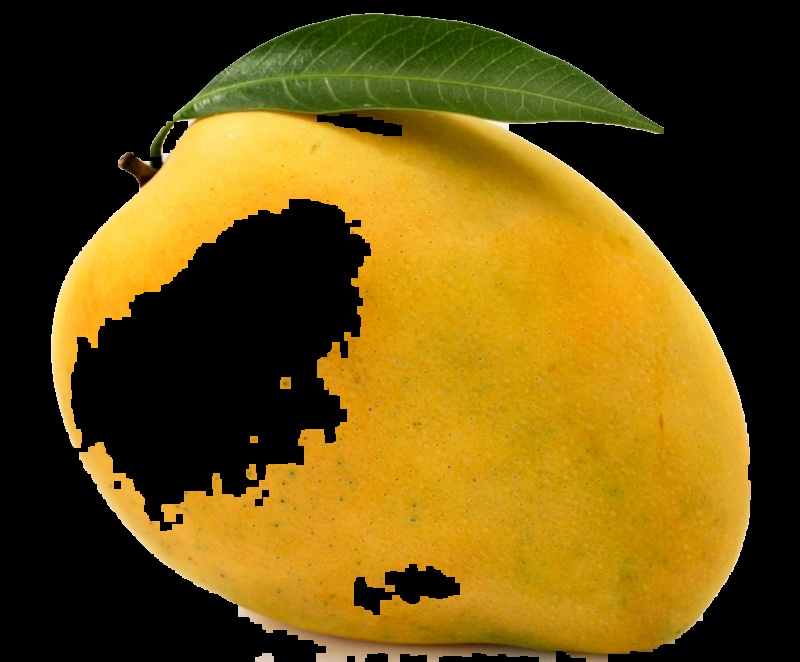
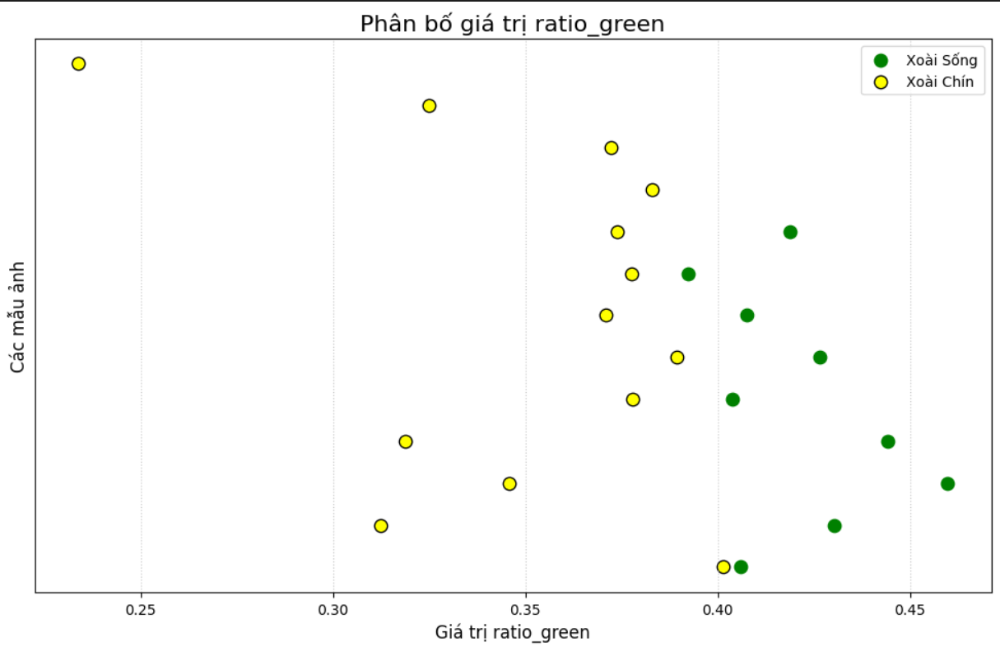
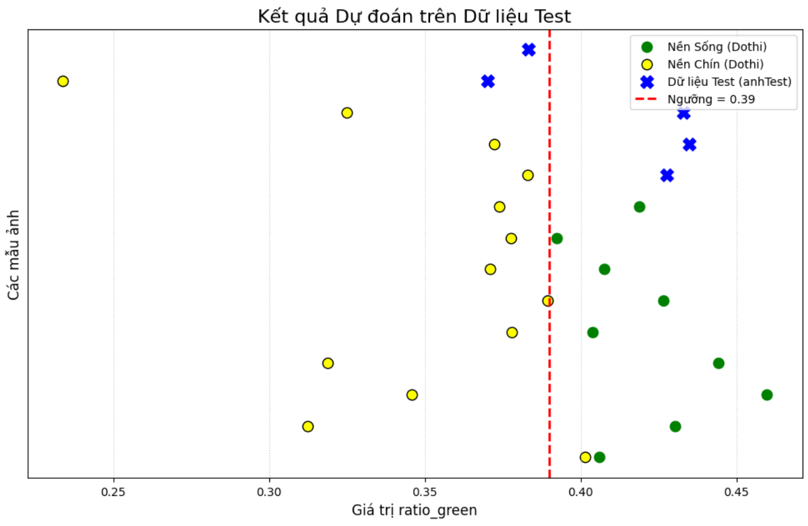

# Classification of Mangoes (Phân loại Xoài)
Dự án này tập trung vào việc phân loại xoài (xoài chín, xoài xanh) sử dụng các kỹ thuật xử lý ảnh cơ bản, đặc biệt là phương pháp ngưỡng màu (Color Thresholding) và đặc trưng màu sắc để xác định trạng thái của quả xoài.
# Mục tiêu Dự án
Mục tiêu chính là xây dựng một hệ thống phân loại nhẹ và nhanh chóng mà không cần sử dụng các mô hình học sâu (Deep Learning) phức tạp, nhằm minh họa sức mạnh của các phương pháp Thị giác Máy tính (Computer Vision) truyền thống trong các tác vụ phân loại cơ bản.

# Các Công nghệ và Thư viện Sử dụng
Python: Ngôn ngữ lập trình chính.

OpenCV (cv2): Thư viện chính để xử lý ảnh, áp dụng ngưỡng màu (HSV/RGB), và tính toán các đặc trưng (diện tích, hình dạng).

NumPy: Để xử lý hiệu quả các mảng dữ liệu (ảnh).

Matplotlib (hoặc tương tự): Để hiển thị kết quả.

# Phương pháp thực hiện
## 1. Tiền xử lý dữ liệu (Background Removal)
Mục tiêu: Tách quả xoài ra khỏi nền và trả về ảnh nền đen (xu_ly_mot_anh).

Không gian màu: Chuyển ảnh sang HSV.

Ngưỡng (Masking): Tạo mask bằng cách kết hợp các dải màu đại diện cho xoài (xanh-vàng và đỏ) .

Làm mịn Mask: Áp dụng các phép toán hình thái học (MORPH_CLOSE và MORPH_OPEN) để làm mịn vùng mask.

## 2. Trích đặc trưng (ratio_green)
Định nghĩa: Đặc trưng là tỉ lệ kênh Green (G) so với tổng các kênh màu (R+G+B) trong vùng quả xoài.

ratio_green = Tổng pixel G / Tổng pixel(R + G +B)

Phân biệt: Xoài sống có tỉ lệ ratio_green cao hơn ngưỡng. Xoài chín có tỉ lệ ratio_green thấp hơn ngưỡng.

## 3. Huấn luyện và đánh giá
Phương pháp huấn luyện: Sử dụng kỹ thuật Cross-Validation và K-Fold trên 22 lần thử nghiệm để tìm ngưỡng phân loại tối ưu trên tập Train.
Quy tắc phân loại: Nếu tỉ lệ ratio_green cao hơn ngưỡng , dự đoán là Sống. Ngược lại là Chín

# Một số hình ảnh liên quan

## Tiền xử lý ảnh

## Biểu diễn dữ liệu

## Test ảnh đầu vào với ngưỡng

